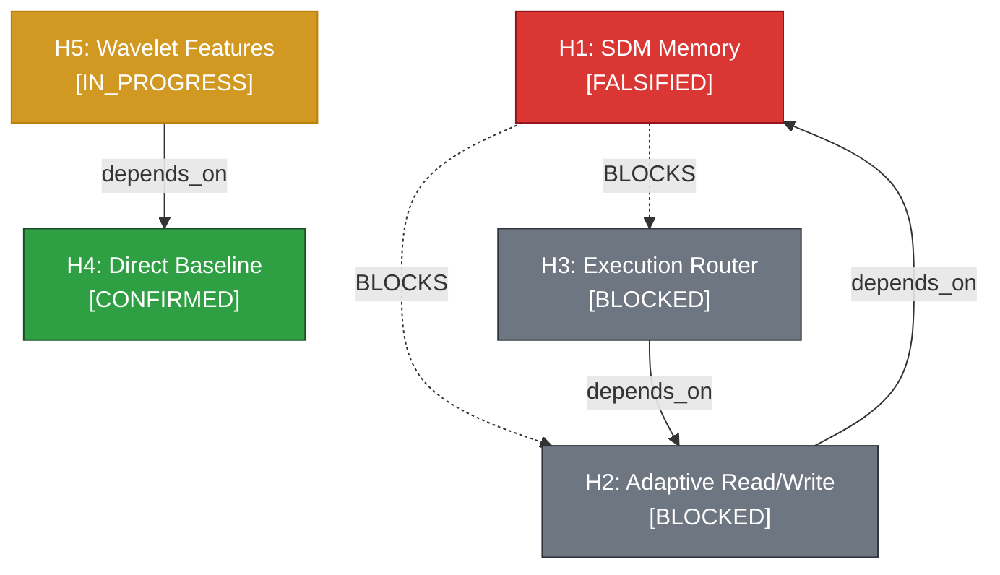

# Epires — Epistemic Auto-Research Harness

> версия на русском доступна в [README_RU.md](README_RU.md).

<div align="center">

[](https://www.python.org/downloads/)
[](https://fastapi.tiangolo.com)
[](https://modelcontextprotocol.io)
[](https://hypothesis.readthedocs.io/)
[](https://github.com/parallel-web)
[](LICENSE)

**An epistemic auto-research harness and governance engine for scientific discovery, quantitative modeling, and machine learning.**  
*Built upon a 10,000-dimensional VSA Hypergraph (HSME heritage), Popperian falsification, E0–E5 evidence scaling, and the Lead Principal Investigator (Lead-PI) protocol.*

</div>

---

## 📑 Table of Contents

1. [Introduction: The Autoresearch Dilemma](#1-introduction-the-autoresearch-dilemma)
2. [Quickstart & Installation](#2-quickstart--installation)
3. [Architecture Overview](#3-architecture-overview)
4. [Research Methodology & Epistemology](#4-research-methodology--epistemology)
   - [4.1 VSA Hypergraph: Experiments as Hypervectors](#41-vsa-hypergraph-experiments-as-hypervectors)
   - [4.2 Hypothesis-First & Popperian Falsification](#42-hypothesis-first--popperian-falsification)
   - [4.3 Evidence Scaling (E0–E5) and Source Provenance [V]/[P]/[D]](#43-evidence-scaling-e0e5-and-source-provenance-vpd)
   - [4.4 Cascading DAG Invalidation](#44-cascading-dag-invalidation)
   - [4.5 Separation of Concerns: Lead-PI vs Coder Subagents](#45-separation-of-concerns-lead-pi-vs-coder-subagents)
   - [4.6 Zero-Overhead Epistemic Tracing](#46-zero-overhead-epistemic-tracing)
   - [4.7 Antifragile Dual-Mode Onboarding](#47-antifragile-dual-mode-onboarding)
5. [CLI Command Reference](#5-cli-command-reference)
6. [Model Context Protocol (MCP) Specification](#6-model-context-protocol-mcp-specification)
7. [Testing & Mathematical Fuzzing](#7-testing--mathematical-fuzzing)
8. [License](#8-license)

---

## 1. Introduction: The Autoresearch Dilemma

Current automated research and coding agents (e.g., vanilla Autoresearch, AIDE, naive Keep-or-Revert loops) typically follow a **greedy linear search loop**:

$$
\text{Code} \xrightarrow{\text{LLM Mutation}} \text{New Code} \xrightarrow{\text{Eval Script}} \text{Scalar Metric} \xrightarrow{\text{Keep or Revert}} \dots
$$

When applied to serious scientific ML, quantitative finance, or complex systems, this paradigm suffers from critical failure modes:
1. **Reward Hacking & Horizon Truncation**: Agents overfit to local validation windows, cherry-pick random seeds, and introduce technical debt to maximize a transient scalar.
2. **Loss of Epistemic Memory**: The system fails to understand *why* a mutation succeeded and discards the valuable search-space reduction provided by negative results.
3. **Flat Code Mutations vs Causal DAGs**: Experiments are treated as isolated text diffs rather than a structured causal graph of interconnected theoretical hypotheses.

**Epires** addresses this by providing an end-to-end auto-research harness integrating **Vector Symbolic Architectures (VSA)**, **Hypothesis Dependency DAGs**, and **automated epistemic gatekeeping**.

---

## 2. Quickstart & Installation

### Installation via pip

Install from PyPI:

```bash
pip install epires
```

Or install directly from source for local development:

```bash
git clone https://github.com/himera/epires.git
cd epires

# Editable installation with dev dependencies
pip install -e ".[dev]"
```

*(For `uv` users: `uv add epires` or `uv sync --extra dev`)*

---

### Workspace Initialization

The `init` command performs a safe, non-destructive setup in the current directory (supporting both clean repositories and existing codebases):

```bash
# 1. Reconnaissance scan (detects domain, existing docs, stack, and metrics)
epires recon

# 2. Initialize research environment (.epires/, .gitignore, config.json, MCP config)
epires init
```

---

### Running the Services

```bash
# 1. Start the MCP Server for AI coding assistants (Cursor, Claude Code, Antigravity):
epires mcp

# 2. Start the FastAPI REST API Server & Web Dashboard (open http://localhost:8000 in your browser):
epires serve --port 8000

# 3. Inspect research status and generate Mermaid DAG in the terminal:
epires status
epires dag
```

---

## 3. Architecture Overview

```
┌────────────────────────────────────────────────────────────────────────┐
│                        LLM Agent / Subagents                           │
│   (Governed by Cognitive Protocol: skills/epires_researcher)           │
└───────────────────┬────────────────────────────────┬───────────────────┘
                    │ Model Context Protocol (MCP)   │ Real-time Delta Stream
                    ▼                                ▼
┌────────────────────────────────────────────────────────────────────────┐
│                    Epires Core & Server Engine                         │
│                                                                        │
│  ┌──────────────────────┐  ┌────────────────────┐  ┌────────────────┐  │
│  │   VSA Hypergraph     │  │ Cascading DAG      │  │ Auto-Tracer    │  │
│  │   (10,000-D Engine)  │  │ (Falsification)    │  │ (SQLite + MD)  │  │
│  └──────────┬───────────┘  └─────────┬──────────┘  └────────┬───────┘  │
└─────────────┼────────────────────────┼──────────────────────┼──────────┘
              │                        │                      │
              ▼                        ▼                      ▼
┌─────────────────────────┐  ┌───────────────────┐  ┌───────────────────┐
│   .epires/hypotheses.db │  │ docs/agent-trace  │  │ Research Atlas UI │
│   (SQLite + VSA Vectors)│  │ (Audit Trail)     │  │ (Web Dashboard)   │
└─────────────────────────┘  └───────────────────┘  └───────────────────┘
```

### Module Layout:

* `epires_core/vsa.py` — 10,000-dimensional Bipolar VSA algebra ($\text{bind}$, $\text{permute}$, $\text{bundle}$, cosine similarity).
* `epires_core/hypergraph.py` — Vectorization of n-ary experimental hyperedges into hypervectors.
* `epires_core/store.py` — Embedded SQLite storage, vector index, and cascading DAG invalidation.
* `epires_core/tracer.py` — Automated logger syncing actions between SQLite and `docs/agent-trace.md`.
* `epires_core/config.py` — Dynamic project configuration (`.epires/config.json`) and heuristic topology scanner.
* `tools/web_search.py` — Multi-query literature and web search gateway powered by `parallel-web 1.3.0` SDK.
* `server/app.py` — FastAPI REST API & Web Dashboard backend (CRUD, Gap Analysis, Stratigraphy, Provenance, WebSockets).
* `server/static/` — Research Atlas SPA frontend (interactive DAG visualizer, dossier, timeline, artifacts explorer).
* `server/mcp_server.py` — FastMCP server exposing 10 research tools to AI agents.
* `skills/epires_researcher/SKILL.md` — Cognitive protocol and operational standard for the Lead Principal Investigator.

---

### 🌐 Research Atlas (Web Dashboard)

Epires includes a built-in real-time observational research atlas accessible at `http://localhost:8000`:

* **Live Reactive DAG Visualizer**: Interactive Voronoi pebble cards with Catmull-Rom cubic splines, smart multi-subgraph matrix layout, node dragging, and automatic position persistence.
* **Monograph Dossier**: Comprehensive 5-section inspection panel featuring theoretical mechanisms, Popperian falsification thresholds, metric delta confidence intervals (CI95), and entity combinations.
* **Stratigraphy Event Stream**: Complete chronological timeline uniting hypothesis registrations, empirical evidence verdicts, and agent trace entries.
* **Entity Coverage Grid**: Matrix projection across Cartesian spaces ($\text{Model} \times \text{Feature} \times \text{Regime}$) to instantly spotlight unexplored white spaces.
* **Provenance Ledger & Artifacts Explorer**: Transparent audit trail mapping citations, code commits, evidence claims, and local filesystem artifacts (`artifacts/`) with direct file viewing.
* **Zero-Latency WebSocket Sync**: Instant delta broadcast (`/ws`) reflecting agent actions in real time with ultra-low polling fallback (`/atlas/version`).
* **Design Aesthetic**: Swiss coordinate dot matrix canvas with Bayer ordered dithering and risograph halftone shaders.

---

## 4. Research Methodology & Epistemology

```
[Web/ArXiv Search] ➔ [VSA Gap Discovery] ➔ [Register Hypothesis] ➔ [Contract Delegation] ➔ [Zero-Trust Audit] ➔ [Log Evidence & DAG Update] ➔ [AutoTrace]
```

### 4.1 VSA Hypergraph: Experiments as Hypervectors

In traditional graph databases (Neo4j, RDF), an experiment is fractured across dozens of binary relations $(A \to B)$, losing structural integrity. Epires implements **Hypergraph-as-a-Vector** (inspired by HSME and Kanerva SDM memory architectures):

Each hypothesis or experiment is encoded as an **n-ary hyperedge** into a single bipolar hypervector $\mathbf{v} \in \{-1, +1\}^D$ ($D = 10{,}000$) using three algebraic operations:

1. **Bind ($\otimes$)**: Element-wise multiplication binding roles to values:

$$
\mathbf{v}_{\text{bound}} = \mathbf{v}_{\text{role}} \odot \mathbf{v}_{\text{value}}
$$

*Property*: Reversible ($\mathbf{v}_{\text{bound}} \odot \mathbf{v}_{\text{role}} = \mathbf{v}_{\text{value}}$) and quasi-orthogonal to both inputs.

2. **Permute ($\sigma$)**: Cyclic vector permutation encoding relation directionality:

$$
\mathbf{v}_{\text{edge}} = \mathbf{v}_{\text{src}} \odot \mathbf{v}_{\text{rel}} \odot \sigma^k(\mathbf{v}_{\text{tgt}})
$$

3. **Bundle ($\oplus$)**: Majority voting bundling multiple entities and relations into a single composite representation:

$$
\mathbf{v}_{\text{hyperedge}} = \mathrm{sign}\left(\sum_{i=1}^M \mathbf{v}_i\right)
$$

#### Automated Gap Discovery
Using algebraic projections in the hypervector space, Epires computes unstudied Cartesian product combinations across dimensions:

$$
\text{Gaps} = (\mathcal{M}_{\text{models}} \times \mathcal{F}_{\text{features}} \times \mathcal{R}_{\text{regimes}}) \setminus \mathcal{E}_{\text{tested}}
$$

---

### 4.2 Hypothesis-First & Popperian Falsification

> *«No execution without prior mathematical justification and numerical falsification criteria.»*

Every hypothesis must be registered in the VSA Hypergraph **before** code implementation begins, specifying:
1. **A Priori Mechanism**: The theoretical rationale establishing why the hypothesis should hold.
2. **Popperian Falsification Criteria**: Explicit numerical boundaries that refute the claim (e.g., *«RMSLE on OOT validation exceeds 1.85»* or *«SDM hit@1 precision < exact kNN by > 5%»*).

---

### 4.3 Evidence Scaling (E0–E5) and Source Provenance [V]/[P]/[D]

Claims must never exceed their verified evidence level:

| Level | Definition | Acceptance Gate |
| :---: | :--- | :--- |
| **E0** | Speculative Hypothesis | A priori mechanism registered in VSA DAG |
| **E1** | Mechanism Implemented | Implementation complete with unit test coverage |
| **E2** | Descriptive / Local Replay | Deterministic local replay or smoke test pass |
| **E3** | Targeted Evaluation | Statistically significant gain on validation holdout |
| **E4** | Out-of-Time / CI95 | Repeated OOT cross-validation with 95% Bootstrap CI strictly superior |
| **E5** | Hidden Test / Production | Final verification on unobserved test partition or live production |

#### Source Provenance Tags:
* `[V]` (Primary Verified) — Directly verified primary artifact or source code;
* `[P]` (Secondary Reported) — External report or leaderboard submission;
* `[D]` (Inferred) — Deduced from adjacent literature.

---

### 4.4 Cascading DAG Invalidation

Hypotheses are structured in a directed acyclic graph (`DEPENDS_ON`).



When an empirical experiment falsifies parent hypothesis $H_1$, the `_cascade_falsification` engine computes the transitive closure and automatically transitions all downstream dependent hypotheses ($H_2, H_3$) into **`BLOCKED`** status, preventing wasted compute on invalid research branches.

---

### 4.5 Separation of Concerns: Lead-PI vs Coder Subagents

> **The Iron Law**: **The Lead Principal Investigator (Lead-PI) NEVER WRITES implementation code.**

* **Lead-PI**: Conducts parallel literature research via `parallel-web`, formulates hypotheses, issues structured task contracts, audits diffs/artifacts, and logs evidence verdicts.
* **Coder Subagents**: Execute strictly defined task contracts:
  ```markdown
  ### Subagent Task Contract: [H-TAG]
  - IN Scope: [Target file, class, or function]
  - OUT of Scope: [Forbidden files or boundaries]
  - Goal / Metric Target: [Quantitative threshold, e.g., delta < -0.005 RMSLE]
  - Definition of Done: [Passing test suite, artifacts written to artifacts/]
  - Output Constraint: "Write digest to artifacts/<name>.md and return <= 10-line summary"
  ```
* **Zero-Trust Summary Rule**: The Lead-PI never trusts subagent summaries at face value. Code diffs, log outputs, and hash manifests must be inspected directly.

---

### 4.6 Zero-Overhead Epistemic Tracing

The `AutoTracer` module eliminates manual logging overhead. Every tool call and state transition is captured synchronously:
1. In the SQLite `traces` table;
2. In the GitHub-flavored Markdown table at `docs/agent-trace.md` with UTC timestamps, agent roles, and Git commit hashes:

| Timestamp (UTC) | Role | Action | H-Tag | Commit | Summary |
|---|---|---|---|---|---|
| 2026-08-19 21:14:11 | **Lead-PI** | `REGISTER_HYPOTHESIS` | `H14` | `4c70725` | Registered H14: Renewal State Modeling |
| 2026-08-19 21:15:30 | **Lead-PI** | `LOG_EVIDENCE` | `H14` | `4c70725` | Evidence [E4, V] logged -> FALSIFIED! Blocked 2 child hypotheses. |

---

### 4.7 Antifragile Dual-Mode Onboarding

Epires adapts seamlessly to any repository structure:

* **Mode A: Clean / Empty Repositories**: Interactive user interview ➔ directory scaffolding ➔ `.epires/config.json` initialization ➔ ready for baseline hypothesis $H_0$.
* **Mode B: Existing / Custom Repositories**: Topology reconnaissance ➔ dynamic path & metric inference ➔ interactive user alignment ➔ path binding in `.epires/config.json` and `AGENTS.md` ➔ historical hypothesis ingestion.

---

## 5. CLI Command Reference

```bash
# Initialize Epires in the current repository
epires init [--dir <path>] [--force]

# Perform reconnaissance scan on repository topology and domain
epires recon [--dir <path>]

# Start the MCP stdio server for AI agents
epires mcp

# Start the FastAPI REST API server & Web Dashboard
epires serve [--host 127.0.0.1] [--port 8000]

# Display hypothesis status in terminal
epires status

# Output Mermaid DAG diagram
epires dag
```

---

## 6. Model Context Protocol (MCP) Specification

Epires exposes 11 deterministic MCP tools for AI agents:

| MCP Tool | Description |
| :--- | :--- |
| `epires_register_hypothesis` | Registers a hypothesis with a priori proof and falsification criteria |
| `epires_log_evidence` | Logs empirical evidence, metrics, CI95, and cascades falsification |
| `epires_retract_evidence` | Retracts erroneous evidence, recalculates evidence level, and cascades unblocking |
| `epires_query_graph` | Queries hypotheses by ID or status (CONFIRMED, FALSIFIED, BLOCKED) |
| `epires_find_gaps` | Discovers untested combinations and research white spots in VSA hypergraph |
| `epires_associative_search` | Sub-millisecond VSA cosine similarity search across the research graph |
| `epires_parallel_web_search`| Multi-query parallel literature/web search via SDK `parallel-web 1.3.0` |
| `epires_parallel_extract` | Structured full text/markdown extraction from specific URLs |
| `epires_export_mermaid_dag` | Exports knowledge graph DAG into Mermaid Markdown |
| `epires_record_trace` | Logs strategic rationale into SQLite traces and Markdown ledger |
| `epires_system_status` | Returns harness version, database status, and search connectivity |

---

## 7. Testing & Mathematical Fuzzing

The engine is verified using **property-based fuzz testing** powered by `hypothesis`:

```bash
pytest -v
============================== 30 passed in 3.66s ==============================
```

### Verified Mathematical Invariants:
* **VSA Invertibility**: $\text{bind}(\text{bind}(\mathbf{a}, \mathbf{b}), \mathbf{b}) \equiv \mathbf{a}$ across arbitrary hypervectors.
* **DAG Cascading Invariant**: Falsifying any node in a random DAG strictly blocks **all and only** its transitive descendants (verified against BFS ground truth).
* **Retraction & Unblock Invariant**: Retracting a falsifying claim strictly unblocks all descendants whose remaining parents are valid.
* **Storage Resilience**: Complete tolerance to arbitrary Unicode payloads, extreme floats ($\pm 10^8$), and empty tags.

---

## 8. License

Distributed under the MIT License. See [LICENSE](LICENSE) for details.
