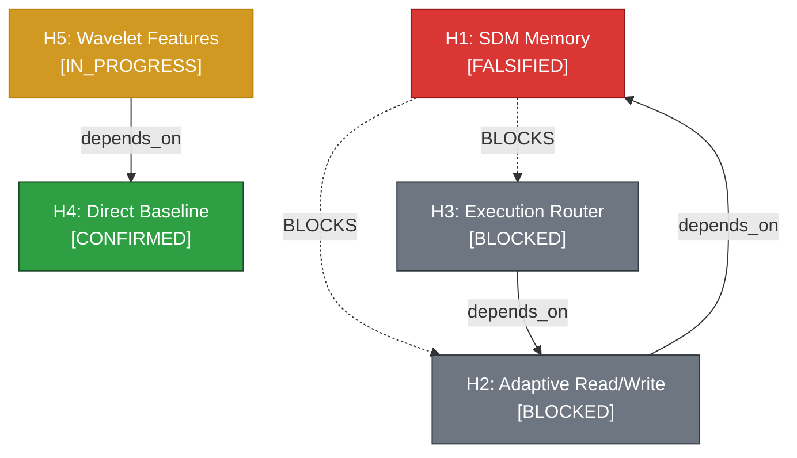

# Epires — Детерминированный Auto-Research харнесс (Русская версия)

> 🌐 English version is available at [README.md](README.md).

<div align="center">

[](https://www.python.org/downloads/)
[](https://fastapi.tiangolo.com)
[](https://modelcontextprotocol.io)
[](https://hypothesis.readthedocs.io/)
[](https://github.com/parallel-web)
[](LICENSE)

**Детерминированный Auto-Research харнесс и движок управления исследованиями для AI-агентов.**  
*Построен на базе 10 000-мерного VSA-гиперграфа (наследие HSME), попперовской фальсификации, доказательной шкале E0–E5 и протоколе Главного Исследователя (Lead-PI).*

</div>

---

## 📑 Оглавление

1. [Введение: Проблема современных AutoResearch систем](#1-введение-проблема-современных-autoresearch-систем)
2. [Быстрый старт (Quickstart & Установка)](#2-быстрый-старт-quickstart--установка)
3. [Архитектура системы](#3-архитектура-системы)
4. [Методология ресерча и эпистемология](#4-методология-ресерча-и-эпистемология)
   - [4.1 VSA-Гиперграф: Эксперимент как гипервектор](#41-vsa-гиперграф-эксперимент-как-гипервектор)
   - [4.2 Принцип «Hypothesis-First» и попперовская фальсификация](#42-принцип-hypothesis-first-и-попперовская-фальсификация)
   - [4.3 Доказательная шкала E0–E5 и доверие источникам [V]/[P]/[D]](#43-доказательная-шкала-e0e5-и-доверие-источникам-vpd)
   - [4.4 Каскадная фальсификация DAG (Cascading Invalidation)](#44-каскадная-фальсификация-dag-cascading-invalidation)
   - [4.5 Разделение ролей: Lead-PI против субагентов-кодеров](#45-разделение-ролей-lead-pi-против-субагентов-кодеров)
   - [4.6 Автоматический трейсинг (Zero-Overhead Tracing)](#46-автоматический-трейсинг-zero-overhead-tracing)
   - [4.7 Антихрупкий онбординг (Dual-Mode Onboarding)](#47-антихрупкий-онбординг-dual-mode-onboarding)
5. [Инструментарий и CLI Справочник](#5-инструментарий-и-cli-справочник)
6. [Model Context Protocol (MCP) Спецификация](#6-model-context-protocol-mcp-спецификация)
7. [Тестирование и математический фаззинг](#7-тестирование-и-математический-фаззинг)

---

## 1. Введение: Проблема современных AutoResearch систем

Большинство существующих инструментов автоматизации исследований (Weco CLI, AIDE, Karpathy AutoResearch) оперируют в парадигме **«жадного линейного поиска»**:

$$\text{Code} \xrightarrow{\text{LLM Mutation}} \text{New Code} \xrightarrow{\text{Eval Script}} \text{Scalar Metric} \xrightarrow{\text{Keep or Revert}} \dots$$

Для сложных междисциплинарных и квант-задач такой подход оказывается неэффективным по фундаментальным причинам:
1. **Иллюзия прогресса и Reward Hacking**: агент переобучается на локальные валидационные окна, читерит на сидах и разрушает архитектуру ради мимолетного улучшения скаляра.
2. **Отсутствие причинно-следственной памяти**: система не понимает, *почему* изменение сработало, и теряет знание об отрицательных результатах.
3. **Плоский перебор вместо графа знаний**: эксперименты изолированы друг от друга, а зависимости между предпосылками не отслеживаются.

**Epires** решает эту проблему через синтез **векторно-символической памяти (VSA)**, **графа причинно-следственных связей (DAG)** и **строгого протокола доказательности**.

---

## 2. Быстрый старт (Quickstart & Установка)

### Установка через pip

```bash
git clone https://github.com/himera/epires.git
cd epires

# Базовая установка
pip install -e .

# Или установка с зависимостями для разработки и фаззинга
pip install -e ".[dev]"
```

*(Для пользователей `uv` также доступно: `uv sync --extra dev`)*

---

### Инициализация рабочего пространства

Команда `init` выполняет неразрушающую настройку в текущем репозитории (как чистом, так и существующем):

```bash
# Разведывательный скан репозитория (детекция стека, домена и метрик)
python main.py recon

# Инициализация лаборатории (создание .epires/, .gitignore, config.json, MCP конфига)
python main.py init
```

---

### Запуск серверов

```bash
# 1. Запуск MCP-сервера для AI-агентов (Cursor / Claude Code / Antigravity):
python main.py mcp

# 2. Запуск REST API сервера и Веб-Дашборда (откройте http://localhost:8000 в браузере):
python main.py serve --port 8000

# 3. Просмотр статуса лаборатории и Mermaid DAG в терминале:
python main.py status
python main.py dag
```

---

## 3. Архитектура системы

```
┌────────────────────────────────────────────────────────────────────────┐
│                        LLM-Агент / Субагенты                           │
│   (Управляется когнитивным протоколом: skills/epires_researcher)       │
└───────────────────┬────────────────────────────────┬───────────────────┘
                    │ Model Context Protocol (MCP)   │ Real-time Delta Stream
                    ▼                                ▼
┌────────────────────────────────────────────────────────────────────────┐
│                    Epires Core & Server Engine                         │
│                                                                        │
│  ┌──────────────────────┐  ┌────────────────────┐  ┌────────────────┐  │
│  │   VSA Hypergraph     │  │ Cascading DAG      │  │ Auto-Tracer    │  │
│  │   (10,000-D Engine)  │  │ (Falsification)    │  │ (SQLite+MD)    │  │
│  └──────────┬───────────┘  └─────────┬──────────┘  └────────┬───────┘  │
└─────────────┼────────────────────────┼──────────────────────┼──────────┘
              │                        │                      │
              ▼                        ▼                      ▼
┌─────────────────────────┐  ┌───────────────────┐  ┌───────────────────┐
│   .epires/hypotheses.db │  │ docs/agent-trace  │  │ Research Atlas UI │
│   (SQLite + VSA Vectors)│  │ (Audit Trail)     │  │ (Web Dashboard)   │
└─────────────────────────┘  └───────────────────┘  └───────────────────┘
```

### Структура модулей:

* `epires_core/vsa.py` — 10 000-мерная векторно-символическая алгебра ($\text{bind}$, $\text{permute}$, $\text{bundle}$, косинусная близость).
* `epires_core/hypergraph.py` — преобразование n-арных гиперребер гипотез и экспериментов в компактные гипервекторы.
* `epires_core/store.py` — встраиваемое SQLite хранилище, векторный индекс и алгоритм каскадной инвалидации DAG.
* `epires_core/tracer.py` — автоматический трейсер для регистрации решений в SQLite и генерации `docs/agent-trace.md`.
* `epires_core/config.py` — динамический конфиг проекта (`.epires/config.json`) и эвристический сканер топологии.
* `tools/web_search.py` — многопоточный поисковый шлюз на базе SDK `parallel-web 1.3.0`.
* `server/app.py` — бэкенд FastAPI REST API и Веб-Дашборда (CRUD, Gap Analysis, Стратиграфия, Provenance, WebSockets).
* `server/static/` — фронтенд Research Atlas SPA (интерактивный визуализатор DAG, досье, таймлайн, просмотрщик артефактов).
* `server/mcp_server.py` — FastMCP сервер инструментов для AI-агентов (10 детерминированных инструментов).
* `skills/epires_researcher/SKILL.md` — протокол Главного Исследователя (Lead-PI).

---

### 🌐 Research Atlas (Веб-Дашборд)

Epires содержит встроенный наблюдательный исследовательский атлас реального времени, доступный по адресу `http://localhost:8000`:

* **Интерактивный реактивный DAG**: Визуализация гипотез в виде карточек Voronoi Pebble на базе кубических сплайнов Катмулла-Рома, умная матричная раскладка несвязных подграфов, перетаскивание узлов и сохранение координат в `localStorage`.
* **Монографическое досье (Dossier)**: 5-секционная детальная карточка гипотезы с априорным обоснованием, критерием фальсификации Поппера, доверительными интервалами метрик (CI95) и составом сущностей.
* **Стратиграфический поток событий (Stratigraphy)**: Единый хронологический таймлайн регистраций гипотез, эмпирических свидетельств и авторских трейсов агентов.
* **Матрица покрытия сущностей (Coverage Grid)**: Проекция декартова пространства ($\text{Model} \times \text{Feature} \times \text{Regime}$) для мгновенного нахождения неисследованных белых пятен.
* **Реестр Provenance и Просмотрщик Артефактов**: Прозрачный граф связей между цитатами, коммитами, метриками и файлами в `artifacts/` с возможностью мгновенного просмотра содержимого.
* **WebSocket синхронизация с нулевой задержкой**: Мгновенный бродкаст изменений (`/ws`) при любых действиях агента с легковесным поллинг-фоллбэком (`/atlas/version`).
* **Дизайн-система**: Швейцарская координатная точечная сетка, шейдерный оверлей Байера и эффект ризографии.

---

## 4. Методология ресерча и эпистемология

Методология Epires переносит математическую строгость естественных наук в мир автономных AI-агентов.

```
[Web/ArXiv Search] ➔ [VSA Gap Discovery] ➔ [Register Hypothesis] ➔ [Contract Delegation] ➔ [Zero-Trust Audit] ➔ [Log Evidence & DAG Update] ➔ [AutoTrace]
```

### 4.1 VSA-Гиперграф: Эксперимент как гипервектор

В традиционных графовых базах данных (Neo4j, RDF) сложный эксперимент распадается на изолированные триплеты $(A \to B)$, теряя целостность контекста. В Epires используется концепция **Hypergraph-as-a-Vector** (наследие HSME и архитектур Kanerva SDM):

Каждый эксперимент или гипотеза кодируется как **гиперребро** в единый биполярный вектор $\mathbf{v} \in \{-1, +1\}^D$ размерности $D = 10\,000$ с помощью трех фундаментальных операций:

1. **Bind ($\otimes$)**: Поэлементное умножение, связывающее роль со значением:
   $$\mathbf{v}_{\text{bound}} = \mathbf{v}_{\text{role}} \odot \mathbf{v}_{\text{value}}$$
   *Свойство*: операция обратима $\mathbf{v}_{\text{bound}} \odot \mathbf{v}_{\text{role}} = \mathbf{v}_{\text{value}}$ и ортогональна обоим операндам.
2. **Permute ($\sigma$)**: Циклический сдвиг вектора для кодирования направленности связей:
   $$\mathbf{v}_{\text{edge}} = \mathbf{v}_{\text{src}} \odot \mathbf{v}_{\text{rel}} \odot \sigma^k(\mathbf{v}_{\text{tgt}})$$
3. **Bundle ($\oplus$)**: Мажоритарное голосование для упаковки множества сущностей в один вектор:
   $$\mathbf{v}_{\text{hyperedge}} = \text{sign}\left(\sum_{i=1}^M \mathbf{v}_i\right)$$

#### Gap Analysis (Поиск белых пятен)
Через операцию проекции в гипервекторном пространстве Epires вычисляет неисследованные декартовы комбинации параметров:
$$\text{Gaps} = \left(\mathcal{M}_{\text{models}} \times \mathcal{F}_{\text{features}} \times \mathcal{R}_{\text{regimes}}\right) \setminus \mathcal{E}_{\text{tested}}$$

---

### 4.2 Принцип «Hypothesis-First» и попперовская фальсификация

> *«Никакого кода без априорного обоснования и численного критерия фальсификации.»*

Каждая запись в реестре гипотез создается **до** написания первой строчки кода и обязана содержать:
1. **Априорный механизм (A Priori Justification)**: Математическое или физическое доказательство права гипотезы на существование.
2. **Критерий фальсификации Поппера (Falsification Criteria)**: Точное условие, при котором гипотеза признается **опровергнутой** (например, *«RMSLE на OOT фолде > 1.85»* или *«SDM recall уступает kNN по метрике hit@1»*).

---

### 4.3 Доказательная шкала E0–E5 и доверие источникам [V]/[P]/[D]

В Epires запрещено использовать субъективные оценки вроде «код работает». Любое утверждение обязано иметь верифицированный уровень доказанности:

| Уровень | Определение | Критерий прохождения |
| :---: | :--- | :--- |
| **E0** | Speculative Hypothesis | Априорное теоретическое обоснование в VSA-графе |
| **E1** | Mechanism Implemented | Реализация написана и покрыта модульными тестами |
| **E2** | Descriptive / Local Replay | Локальный смоук-тест / детерминированный прогон пройден |
| **E3** | Targeted Evaluation | Статистически значимый выигрыш на валидационном сете |
| **E4** | Out-of-Time / CI95 | Кросс-валидация на OOT-фолдах с 95% Bootstrap доверительным интервалом |
| **E5** | Hidden Test / Production | Финальное подтверждение на скрытом тесте или в проде |

#### Метки достоверности источников:
* `[V]` (Primary Verified) — первоисточник/код/артефакт проверен лично агентом;
* `[P]` (Secondary Reported) — вторичный источник (сторонний отчет/лидерборд);
* `[D]` (Inferred) — логический вывод из смежных данных.

---

### 4.4 Каскадная фальсификация DAG (Cascading Invalidation)

Гипотезы организованы в направленный ациклический граф зависимостей (`DEPENDS_ON`). 



Если эксперимент опровергает базовую гипотезу $H_1$, алгоритм `_cascade_falsification` автоматически находит всех ее потомков ($H_2, H_3$) через транзитивное замыкание и переводит их в статус **`BLOCKED`**. Система физически запрещает агентам тратить вычислительные ресурсы на бесперспективные ветви.

---

### 4.5 Разделение ролей: Lead-PI против субагентов-кодеров

> **The Iron Law**: **Главный агент (Lead-PI) НЕ ПИШЕТ код реализации сам.**

* **Lead-PI**: выполняет поиск литературы через `parallel-web`, генерирует гипотезы, формулирует ТЗ субагентам, проводит аудит diff'ов и артефактов, выносит вердикты E0–E5.
* **Субагенты-кодеры**: получают изолированный контракт:
  ```markdown
  ### Subagent Task Contract: [H-TAG]
  - IN Scope: [Конкретный файл и оптимизируемая функция]
  - OUT of Scope: [Что запрещено изменять]
  - Goal / Metric Target: [Численная цель, например delta < -0.005]
  - Definition of Done: [Тесты зеленые, артефакты сохранены в artifacts/]
  - Output Constraint: "Write digest to artifacts/<name>.md and return <= 10-line summary"
  ```
* **Zero-Trust Summary Rule**: Lead-PI никогда не верит текстовым отчетам субагентов. Проводятся обязательная ручная сверка git diff и аудит сохраненных хешей артефактов.

---

### 4.6 Автоматический трейсинг (Zero-Overhead Tracing)

Модуль `AutoTracer` избавляет агента от рутинного форматирования логов. При каждом вызове инструмента MCP или эндпоинта FastAPI событие мгновенно фиксируется:
1. В реляционной таблице `traces` в SQLite;
2. В структурированной Markdown-таблице `docs/agent-trace.md` с точным временем UTC, ролью агента и текущим Git-хешем:

| Timestamp (UTC) | Role | Action | H-Tag | Commit | Summary |
|---|---|---|---|---|---|
| 2026-08-19 21:14:11 | **Lead-PI** | `REGISTER_HYPOTHESIS` | `H14` | `4c70725` | Registered H14: Renewal State Modeling |
| 2026-08-19 21:15:30 | **Lead-PI** | `LOG_EVIDENCE` | `H14` | `4c70725` | Evidence [E4, V] logged -> FALSIFIED! Blocked 2 child hypotheses. |

---

### 4.7 Антихрупкий онбординг (Dual-Mode Onboarding)

Движок адаптируется под любую структуру репозитория:

* **Mode A: Чистый репозиторий**: опрос пользователя о домене и метрике $\to$ генерация чистых директорий $\to$ создание `.epires/config.json` $\to$ готовность к первой гипотезе $H_0$.
* **Mode B: Существующий репозиторий**: эвристический скан $\to$ выявление существующих документов и логов $\to$ диалог с пользователем $\to$ сохранение утвержденных путей в конфиг $\to$ векторизация старых гипотез в VSA-граф.

---

## 5. Инструментарий и CLI Справочник

```bash
# Инициализация лаборатории в текущей папке
python main.py init [--dir <path>] [--force]

# Разведывательный аудит кодовой базы и домена
python main.py recon [--dir <path>]

# Запуск MCP сервера для агентов
python main.py mcp

# Запуск REST API сервера
python main.py serve [--host 127.0.0.1] [--port 8000]

# Вывод статуса гипотез в терминал
python main.py status

# Вывод Mermaid DAG графа
python main.py dag
```

---

## 6. Model Context Protocol (MCP) Спецификация

Epires предоставляет AI-агентам 10 детерминированных инструментов:

| MCP Tool | Описание |
| :--- | :--- |
| `epires_register_hypothesis` | Регистрация гипотезы с априорным механизмом и критерием фальсификации |
| `epires_log_evidence` | Фиксация эмпирических метрик, CI95 и триггера каскадной фальсификации |
| `epires_query_graph` | Запрос состояния гипотез по ID или статусу (CONFIRMED, FALSIFIED, BLOCKED) |
| `epires_find_gaps` | Поиск белых пятен и неисследованных комбинаций в VSA-гиперграфе |
| `epires_associative_search` | Микросекундный ассоциативный поиск по VSA-гиперграфу через косинусную близость |
| `epires_parallel_web_search`| Многопоточный поиск литературы и статей через SDK `parallel-web 1.3.0` |
| `epires_parallel_extract` | Извлечение структурированного markdown/текста из веб-страниц и статей |
| `epires_export_mermaid_dag` | Экспорт графа знаний в формат Mermaid Markdown |
| `epires_record_trace` | Запись авторской рефлексии и решений в операционный трейс |
| `epires_system_status` | Проверка версии харнесса, статуса базы данных и подключения к Parallel |

---

## 7. Тестирование и математический фаззинг

Движок полностью верифицирован с помощью **property-based фаззинг-тестирования** на базе библиотеки `hypothesis`:

```bash
pytest -v
============================== 29 passed in 3.53s ==============================
```

### Проверяемые математические инварианты:
* **VSA Reversibility**: $\text{bind}(\text{bind}(\mathbf{a}, \mathbf{b}), \mathbf{b}) \equiv \mathbf{a}$ для любых случайных векторов.
* **DAG Cascading Invariant**: фальсификация случайного узла блокирует строго всех и только его транзитивных потомков (проверено через независимый BFS-обход).
* **Store Unicode & Float Resilience**: устойчивость базы данных к произвольным Unicode-символам, экстремальным значениям метрик ($\pm 10^8$) и пустым тегам.

---

## 8. Лицензия

Проект распространяется под лицензией MIT. Подробности в файле [LICENSE](LICENSE).
